> 自己的kali虚拟机打包分享一下，为了节省占用空间大小，其他渗透测试工具自行安装，我安装了算是比较常用的几个（为了省空间）

> 系统版本：kali linux 2023.3

> 固件类型：BIOS

> 用户: zss 密码: ss

> 下载地址：https://cloud.189.cn/t/uI7fYbYbuQRj （访问码：u67q）
> 其他的网盘正在上传中

## 本次美化是i3wm环境

i3wm这个环境日常使用的话效率真的高，基本上全部的操作全是键盘操作系统，有的时候浏览器也可以用vim模式操作浏览器，而且系统占用资源非常非常小

但是配置起来i3环境是挺费劲的基本上全是自己手动写和配置

**i3wm比kali自带的Xfce4更轻量级，所占用的资源更少**

警告！不建议linux小白使用

## 文件和大小

> 文件是vm虚拟机文件

> 压缩的大小是11多个g

> 解压出来大概27多个g

## kali美化版本

### i3配置效果

优点：好看，提高办公效率，占用系统资源少（配置完成的占用比Xfce4资源更少）

缺点：啥东西都要自己配置

警告！不建议linux小白使用

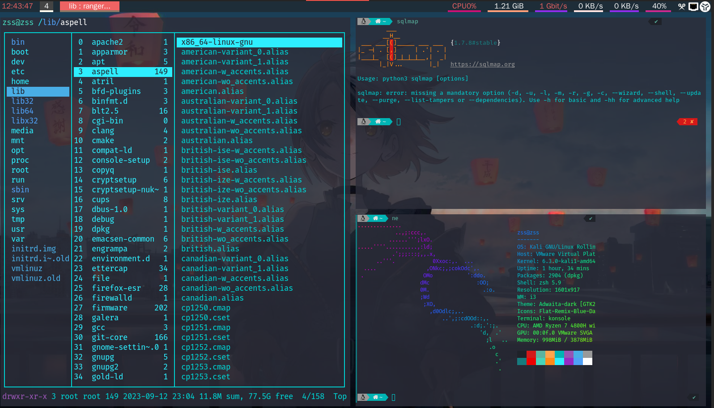

**本来想改更新登录界面的要安装sddm大概要1个多g就没有改有需要自己想改下载sddm即可**

**我这个已经叫相应登录界面的美化文件放到了**/usr/share/sddm/themes**自己修改默认登录界面的配置文件即可**

**大概配置文件是下面这样**

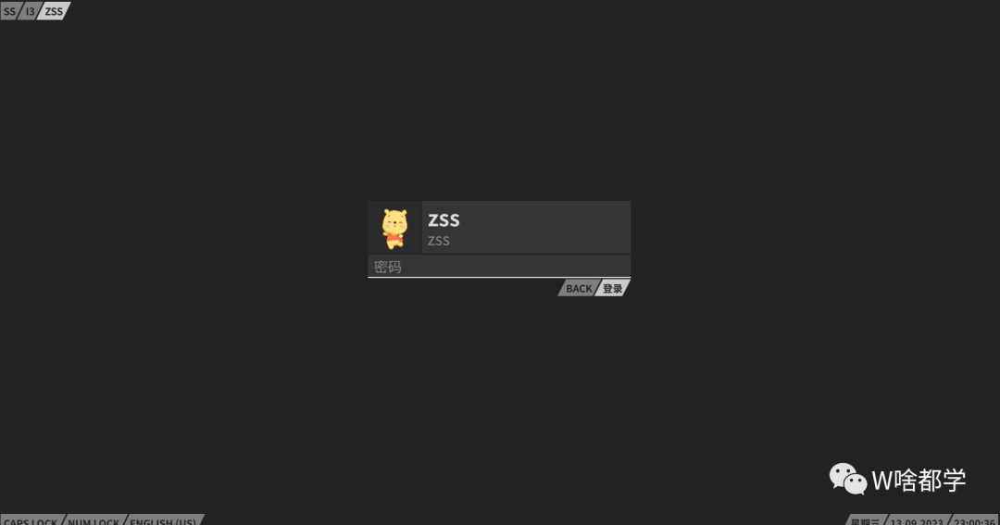


### kde配置效果

优点：好看，插件都是别人写好的可以直接下载搭配

缺点：卡顿

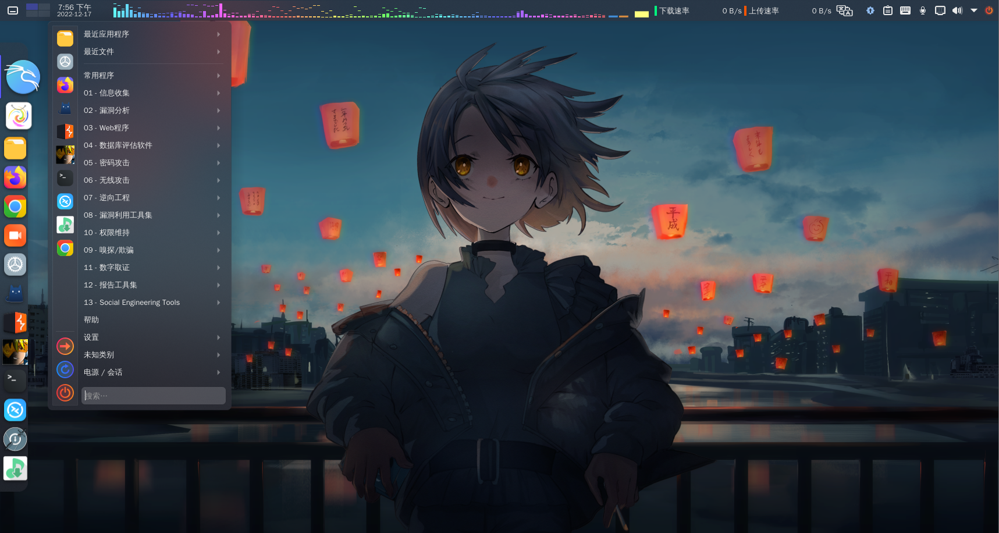

> 文件是vm虚拟机文件

> 压缩的大小是11多个g

> 解压出来大概27多个g
## i3的基本快捷键

> **$mod这个是添加是的键盘的`alt`键**

> 下面我列出来常用的快捷键

### 常用快捷键

方向键快捷键和vi一样

`$mod+j`为左，`$mod+k` 为下，`$mod+l`为上，`$mod+；`为右

| 快捷键                   | 意思                                                         |
| ------------------------ | ------------------------------------------------------------ |
| $mod+Enter               | 打开一个新终端                                               |
| $mod+h                   | 这个是默认，创建一个窗口会在窗口右面创建                     |
| $mod+v                   | 在这个窗口下面，我们做打开一下新的终端就会在当前窗口下面创建 |
| $mod+s                   | 窗口进行堆叠                                                 |
| $mod+w                   | 进行选项卡式                                                 |
| $mod+e                   | 进行拆分/拆分                                                |
| $mod+f                   | 全屏模式或再次退出全屏模式                                   |
| $mod+Shift+q             | 关闭窗口                                                     |
| $mod+指定数字            | 创建工作区                                                   |
| $mod+Shift+指定的数字    | 叫窗口如放到那个工作区                                       |
| $mod+Shift+Space(空格键) | 切换窗口的浮动模式                                           |
| $mod+r                   | 设置窗口大小                                                 |
| $mod+Shift+方向键        | 移动窗口的位置                                               |
| $mod+Shift+r             | 重启 i3                                                      |

下面是配置自己添加的快捷方式

| 快捷键            | 意思                                                         |
| ----------------- | ------------------------------------------------------------ |
| $mod+-            | 隐藏窗口                                                     |
| $mod+=            | 再现窗口                                                     |
| $mod+Shift+a      | 打开程序启动器                                               |
| $mod+Ctrl+d       | 将工作区移至下一个                                           |
| $mod+Ctrl+s       | 上一个工作区并跟随                                           |
| $mod+Shift+Ctrl+q | 关机 l锁屏 p关机 r重启 e退出i3                               |
| $mod+m            | 开启polybar                                                  |
| $mod+Shift+m      | 杀死polybar                                                  |
| $mod+n            | 有边框和标题栏                                               |
| $mod+u            | 无边框和标题栏                                               |
| $mod+o            | 1像素边框                                                    |
| $mod+b            | 可在1像素边框，无边框和标题栏，有边框和标题栏三种风格来回切换 |


## 安装的工具

### 搜狗输入法

### 火狐浏览器插件安装：

- Disable JavaScript

- FoxyProxy

- FindSomething

- Wappalyzer

- 谷歌浏览器

### 集成了我的linux的渗透测试工具箱

  - BorpSuite专业中文
  - C S4.5中文
  - C S4.7中文
  - C S4.8中文
  - Xray社区高级版
  - POC-bomber
  - afrog
  - fscan
  - PackerFuzzer
  - Yasso
  - 综合利用工具
  - 利用工具 By莲花
  - 中国蚁剑
  - 冰蝎3.0
  - 冰蝎4.0.6
  - 哥斯拉4.0.1
  - webshell生成工具
  - ShiroAttack2
  - ShiroExp
  - OA-EXPTOOL
  - 通达OA利用工具
  - Struts2漏洞检查
  - BlueTeamTools分析辅助工具
  - CMSeeK
  - FofaViewer
  - Dirsearch
  - Fofax
  - zpscan
  - OneForAll
  - CmsVulScan
  - CmsVulScan
  - URLFinder
  - XSStrike工具
  - Jboss漏洞检查工具
  - 社工密码生成器
  - Pydictor
  - MDUT
  - ARDM
  - LiqunKit
  - Full-Scanner
  - Apt_t00ls

 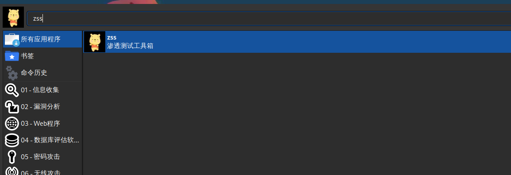

  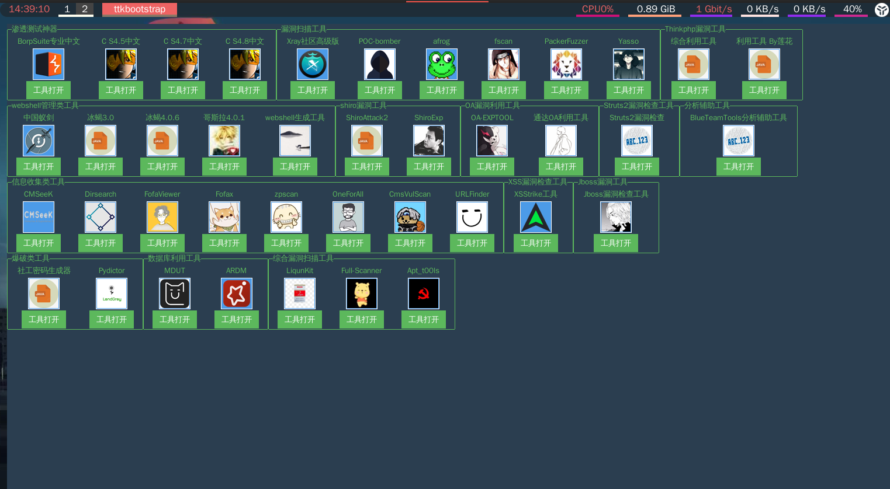

### xcompmgr

默认i3wm是不能透明的我们需要搭配工具使用

是一个简单的混合窗口管理器，可以实现阴影、原生窗口透明（配合`transset`工具）等特效

已经在i3配置文件添加开机自启动`exec --no-startup-id xcompmgr`

### feh壁纸

i3wm是没有提供设置壁纸这个功能的这个用到的是feh工具

设置壁纸命令` feh --randomize --bg-fill 照片`

已经在i3配置文件添加开机自启动`exec_always --no-startup-id feh --randomize --bg-fill  照片`

### nitrogen

通过feh可以设置壁纸后然后我们搭配这个用于控制壁纸管理的工具

### polybar

是一个用于创建状态栏的快速且易于使用的工具，为用户桌面环境构建漂亮且高度可定制的状态栏


下面有配置的源代码

### 字体配置

kali的系统默认的字体在`/usr/share/fonts/truetype`

i3字体设置在i3配置文件`vim ~/.config/i3/config`

格式

```
font pango:家族列表 样式选项 大小
```

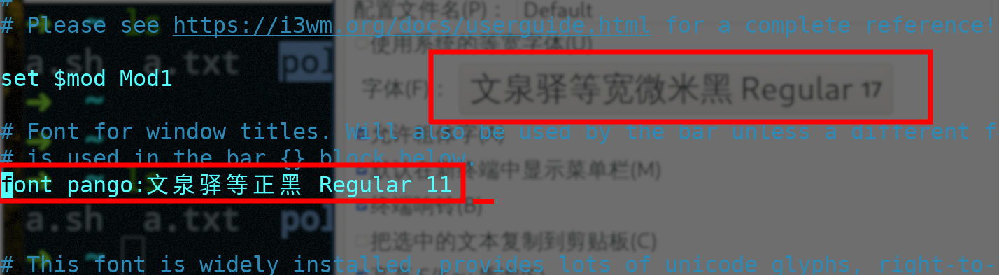

### 设置主题lxappearance

i3wm默认也是没有主题设置的这边搭配的是lxappearance工具进行设置的主题

### 系统通知

默认i3wm没有通知，这个常常会导致系统卡死的问题这边搭配的是dunst工具

添加了开自启动`exec_always dunst  `

包含一个示例配置文件（通常是 /etc/dunst/dunstrc）。注意：这是以前的 /usr/share/dunst/dunstrc。在使用 dunst 之前，将此文件复制到 ~/.config/dunst/dunstrc 并进行相应的编辑

创建文件

```
mkdir ~/.config/dunst/
```

编辑文件

```sh
vim ~/.config/dunst/dunstrc
```

### 颜色修改

默认i3wm配置颜色啥的需要我们在系统配置文件里面手动编写修改

格式

```sh
窗口装饰 边框 背景 正文 指标 儿童边框
```

下面是他的窗口装饰

```
#当前具有焦点的客户端
client.focused

#客户端是其容器的焦点之一，但目前没有焦点
client.focused_inactive

#不是其容器的焦点之一的客户端
client.unfocused			

#已激活紧急提示的客户端
client.urgent

#背景和文本颜色用于绘制占位符窗口内容（恢复布局时）。边框和指示器被忽略
client.placeholder

# 背景颜色将用于绘制客户端窗口的背景，客户端将在该背景上呈现。只有未覆盖此窗口整个区域的客户端才会显示颜色。请注意，此颜色类仅采用单一颜色
client.background
```

演示

```sh
# 窗户颜色
# 定义的参数，就和变量一样
set $bg-color 	         #2f343f  #$bg-color就定于#2f343f 
set $inactive-bg-color   #2f343f
set $text-color          #f3f4f5
set $inactive-text-color #676E7D
set $urgent-bg-color     #E53935
# 窗口装饰					
#                       边框              	背景         			 文本                 指标
						#$bg-color就定于#2f343f 
client.focused          $bg-color             $bg-color         	$text-color          #00ff00
client.unfocused        $inactive-bg-color    $inactive-bg-color 	$inactive-text-color #00ff00
client.focused_inactive $inactive-bg-color    $inactive-bg-color 	$inactive-text-color #00ff00
client.urgent           $urgent-bg-color      $urgent-bg-color   	$text-color          #00ff00
```

### 托盘图标

i3也没有托盘图标无法看见后台程序运行，这边搭配的是xrandr工具效果

蓝牙托盘：安装`apt install blueman`添加系统配置文件自启动`exec --no-startup-id blueman-applet`

电池托盘：安装`apt install mate-power-manager`添加系统配置文件自启动`exec --no-startup-id  mate-power-manager`

网络连接：安装`sudo apt-get install network-manager-gnome`添加系统配置文件自启动`exec --no-startup-id  nm-applet`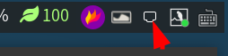

### 中启用身份验证

这个也是非常重要的如果没有添加无法启动root用户的图形化程序这个搭配的是lxpolkit工具

系统配置文件添加自启动`exec --no-startup-id lxpolkit`

## tools

！这个有一个存在的问题至今没有解决，启动不了终端工具比如sqlmap（我也懒得解决了）直接用`$mod+Shift+a`快捷键打开程序启动器

tools工具效率办公，就不用介绍了

我这边设置的快捷键是i3wm的经常用的快捷键`alt+d`

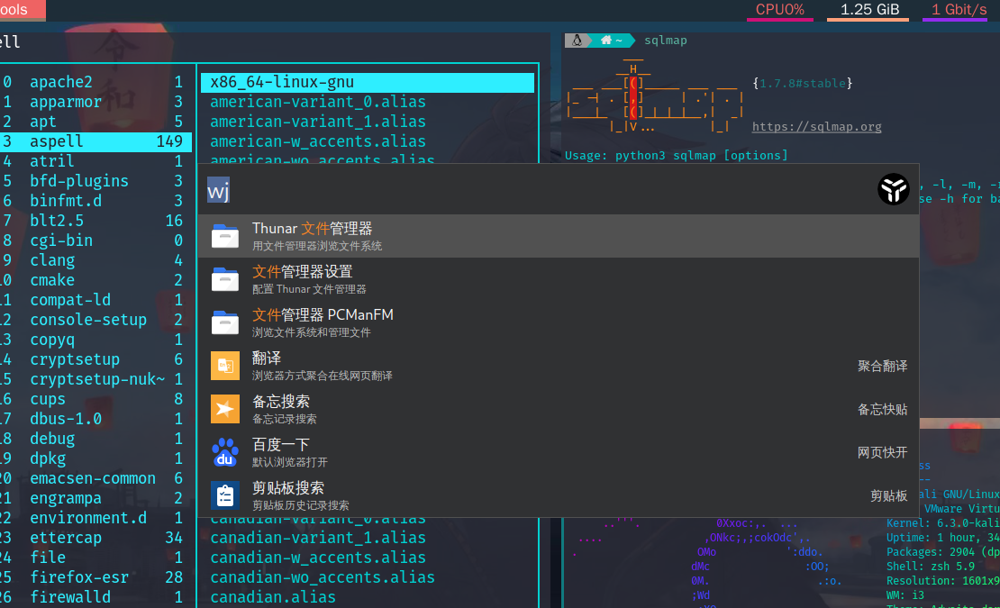

## ranger终端文件管理器

这个在i3的系统里面经常用

下面做了美化的效果图

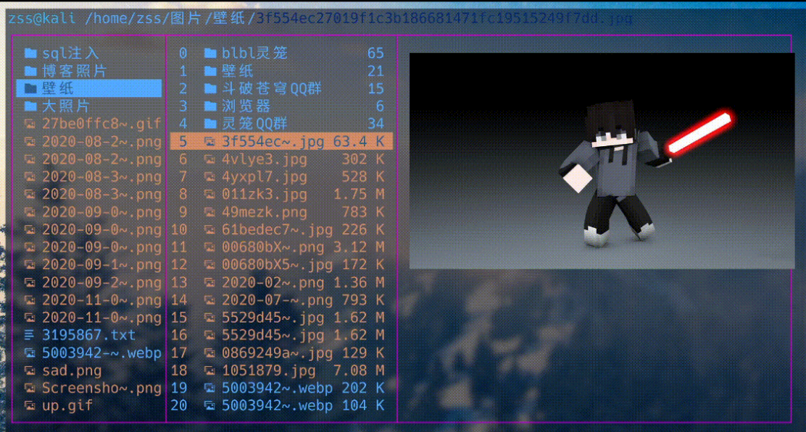

有需要修改配置文件的自行修改文件在``~/.config/ranger``

| 主要配置文件  |                                                    作用 |
| :-----------: | ------------------------------------------------------: |
| `commands.py` | 包含以Python编写的各种函数的实现，用于修改`rangers`行为 |
|   `rc.conf`   |      用于设置各种选项并将按键绑定到功能，就是设置快捷键 |
| `rifle.conf`  |                            决定使用哪个程序打开哪个文件 |
|  `scope.sh`   |             是一个shell脚本，用于生成各种文件类型的预览 |
| plugins文件夹 |                        这个文件夹要自己创建用于添加插件 |

### 列出了一点常用的快捷方式

### 文件管理器操作

| 文件管理器操作 |                 作用 |
| :------------: | -------------------: |
|      `h`       |           返回上一层 |
|      `l`       |             进入文件 |
|      `j`       |                 向下 |
|      `k`       |                 向上 |
|    `Enter`     |             打开文件 |
|      `q`       |                 退出 |
|      `Q`       |             全部退出 |
|   `Shlfl+S`    |       进入目录并提出 |
|      `ZZ`      |                 退出 |
|      `ZQ`      |                 退出 |
|      `R`       |       刷新reload_cwd |
|    `ctrl+r`    |                 重置 |
|    `<c-r>`     |            重置reset |
|       ?        |                 help |
|       W        |         查看运行日志 |
|      `F`       | 冻结文件（只读模式） |

### 删除

| 按键           | 说明                                              |
| :------------- | :------------------------------------------------ |
| `dD` 或者 `F8` | 删除条目（文件或者文件夹），或者 `:` + `delete`。 |
| `DD`           | 将条目移动到回收站里。                            |

### 新建

| 按键     | 说明                           |
| :------- | :----------------------------- |
| `F7`     | 新建文件夹，等同于 `:mkdir `。 |
| `INSERT` | 新建文件，等同于 `:touch `。   |

### 重命名

| 按键 | 说明                             |
| :--- | :------------------------------- |
| `cw` | 重命名（含后缀名）               |
| `I`  | 重命名，光标在最前               |
| `A`  | 重命名，光标在最后（含后缀名）   |
| `a`  | 重命名，光标在最后（不含后缀名） |


### 复制

| 按键           | 说明                                                         |
| :------------- | :----------------------------------------------------------- |
| `yy` 或者 `F5` | 复制文件                                                     |
| `ya`           | `add` 模式，添加光标处文件到复制队列中（文件夹无效）。       |
| `yr`           | `remove` 模式，从复制队列中移除光标处文件（文件夹无效）。    |
| `yt`           | `toggle` 模式，切换光标处文件是否在复制队列中（文件夹无效）。 |

### 剪切

| 按键           | 说明                    |
| :------------- | :---------------------- |
| `dd` 或者 `F6` | 剪切                    |
| `da`           | `add` 模式，同复制。    |
| `dr`           | `remove` 模式，同复制。 |
| `dt`           | `toggle` 模式，同复制。 |
| `dk`           | 同复制                  |
| `dj`           | 同复制                  |
| `dgg`          | 同复制                  |
| `dG`           | 同复制                  |
| `ud` 或者 `uy` | 取消剪切                |

### 粘贴

| 按键  | 说明                                                         |
| :---- | :----------------------------------------------------------- |
| `pp`  | 粘贴                                                         |
| `po`  | 粘贴 强制覆盖                                                |
| `pP`  | `append` 模式，如果该目录中有同名条目，则在条目后面加上 `_`、`_0`、`_1`……。如果条目是文件，则在文件后缀名后加入。 |
| `pO`  | `append` 模式 + `overwrite` 模式。                           |
| `pl`  | 粘贴软链接，不在状态栏显示目标条目的相对路径。               |
| `pL`  | 粘贴为符号链接（相对路径），在状态栏显示目标条目的相对路径。 |
| `phl` | 粘贴为硬链接                                                 |
| `pht` | 粘贴为硬链接的子目录（hardlinked subtree）                   |

### 搜索

| 按键             | 说明                                                         |
| :--------------- | :----------------------------------------------------------- |
| `/`              | 打开搜索框，输入要搜索的字符串，回车后开始搜索。             |
| `f`              | 查找，等同于运行满足条件的文件或者打开满足条件的文件夹。     |
| `zf`             | 与命令行 `filter` 作用一样，只显示符合条件的条目，区分大小写。 |
| `n` `N`          | 查找下一个搜索结果 查找上一个搜索结果                        |
| `c` + `对应字母` | 通过对应属性依次遍历，如：`ca`：通过 `atime`属性依次遍历`cc`：通过 `ctime` 属性依次遍历`ci`：通过 `mimetype` 属性依次遍历`cm`：通过 `mtime` 属性依次遍历`cs`：通过 `size` 属性依次遍历`ct`：通过 `tag` 属性依次遍历 |


### 排序

| 按键 |           说明           |
| :--: | :----------------------: |
|  or  |         反转排序         |
|  os  |     根据文件大小排序     |
|  ob  |     根据文件名称排序     |
|  om  |     根据修改时间排序     |
|  oE  |      根据扩展名排序      |
|  zd  | 切换目录是否排在文件前面 |

### 预览设置

| 按键 |       说明       |
| :--: | :--------------: |
|  zi  | 切换是否预览图片 |
|  zm  | 切换是否允许鼠标 |
|  zp  | 切换是否预览文件 |
|  zP  | 切换是否预览目录 |
|  zh  |   查看隐藏文件   |

### 显示过滤

|     按键     |          说明          |
| :----------: | :--------------------: |
| `zf`或者`zz` | 过滤文件，这个非常好用 |
|     `.d`     |       只显示目录       |
|     `.f`     |       只显示文件       |


### 其他好用的

| 按键 |                             说明                             |
| :--: | :----------------------------------------------------------: |
|  g   |                           快速进入                           |
| `m`n | 字符标记目录，进入标记的目录按一下`'n`，`n`是随便一个标记的一个字符 |
|  r   |                           执行程序                           |


## fzf搜索

这个工具是非常好用的一个搜索工具

配置起来也是好好长时间去折腾

下面是配置自己添加的快捷方式

| 快捷键   | 意思     |
| -------- | -------- |
| `ctrl+r` | 搜索命令 |
| `\+tab`  | 文件搜索 |

搜索语法

| 令牌      | 比赛类型         | 描述                   |
| --------- | ---------------- | ---------------------- |
| `sbtrkt`  | 模糊匹配         | 匹配的项目 `sbtrkt`    |
| `'wild`   | 完全匹配（引用） | 包含的项目 `wild`      |
| `^music`  | 前缀完全匹配     | 开头的项目 `music`     |
| `.mp3$`   | 后缀完全匹配     | 以 `.mp3`              |
| `!fire`   | 反向精确匹配     | 不包括的项目 `fire`    |
| `!^music` | 反向前缀完全匹配 | 不以开头的项目 `music` |
| `!.mp3$`  | 反后缀完全匹配   | 不以 `.mp3`            |

在终端输入sudo apt   然后加`ctrl+r`

效果图

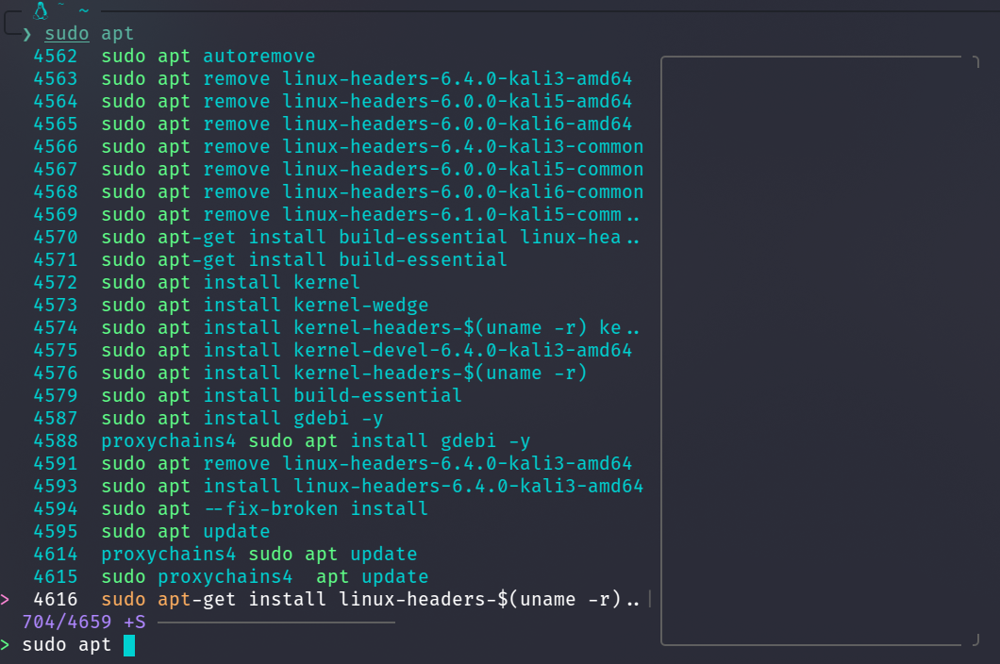

## fzf和ranger搭配

可以通过`:fzf_select`命令来在ranger中启动fzf查找

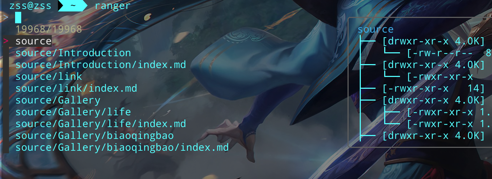

配置快捷键`vim ~/.config/ranger/rc.conf`

```sh
map \ fzf_select
```

在启动ranger我们按`\`就可以用fzf进行搜索了


## 虚拟机vmtools

1. 安装VMware Tools

   ```sh
   pacman -S open-vm-tools 
   ```

2. 安装显卡驱动

   ```
   pacman -S xf86-video-vmware
   ```


3. 使vmware tools开机自启动

   ```sh
   systemctl start vmtoolsd
   systemctl enable vmtoolsd
   ```


4. 安装一些模块

   在这个`vim /etc/mkinitcpio.conf`最后面添加

   ```
   MODULES=(vsock vmw_vsock_vmci_transport vmw_balloon vmw_vmci vmwgfx)
   ```

   运行

   ```
   mkinitcpio -p linux
   ```

5. 安装gtkmm

   ```sh
   pacman -S gtkmm
   ```

6. 如果有问题修复Tools中的60秒BUG

   ```sh
   vim /usr/lib/systemd/system/vmtoolsd.service
   ```

   在`[service]`项的后面增加一行   `KillSignal=SIGKILL`

### 不能复制粘贴解决方法

```
sudo vmware-user-suid-wrapper
```


## i3的config配置修改的源代码

```zsh
set $mod Mod1


# #设置窗口边框等等
new_window none
new_float normal
hide_edge_borders both


#设置窗口间距
gaps inner 12
#gaps outer 6


# 窗户颜色
# 定义的参数，就和变量一样
set $bg-color 	         #2f343f  #$bg-color就定于#2f343f 
set $inactive-bg-color   #2f343f
set $text-color          #f3f4f5
set $inactive-text-color #676E7D
set $urgent-bg-color     #E53935
# 窗口装饰					
#                       边框              	背景         			 文本                指标
						#$bg-color就定于#2f343f 
client.focused          $bg-color             $bg-color         	$text-color          #00ff00
client.unfocused        $inactive-bg-color    $inactive-bg-color 	$inactive-text-color #00ff00
client.focused_inactive $inactive-bg-color    $inactive-bg-color 	$inactive-text-color #00ff00
client.urgent           $urgent-bg-color      $urgent-bg-color   	$text-color          #00ff00
# Font for window titles. Will also be used by the bar unless a different font
# is used in the bar {} block below.
font pango:Bitstream Vera Sans Mono 11


##==========================================自己配置 自启动=================================================================================================
# ======================================================================================================================================================
#exec --no-startup-id  mate-power-manager #电池托盘
exec --no-startup-id blueman-applet #蓝牙托盘
exec --no-startup-id lxpolkit # 身份认证
#exec --no-startup-id  variety #壁纸


# 自带锁屏
exec --no-startup-id xss-lock --transfer-sleep-lock -- i3lockr --blur 60 

# 启动utools 
exec --no-startup-id /usr/bin/utools 
 
exec_always feh --randomize --bg-fill 图片/壁纸/浏览器/792a4b6934fc491b81342206e3192e59.png

# 剪切板管理
exec --no-startup-id copyq

exec --no-startup-id nm-applet

#启动polybar
exec --no-startup-id  ~/.config/polybar/launch.sh  

# 透明
exec --no-startup-id xcompmgr
#exec --no-startup-id /opt/apps/com.baidu.fcitx-baidupinyin/files/bin/bd-qimpanel.watchdog.sh # 启动百度输入法
exec --no-startup-id dunst  # dunst系统通知

# 无操作10分钟自动锁屏
exec --no-startup-id xautolock -time 10000 -locker i3lockr --blur 60
# ======================================================================================================================================================
# ======================================================================================================================================================

# Use pactl to adjust volume in PulseAudio.
set $refresh_i3status killall -SIGUSR1 i3status
bindsym XF86AudioRaiseVolume exec --no-startup-id pactl set-sink-volume @DEFAULT_SINK@ +10% && $refresh_i3status
bindsym XF86AudioLowerVolume exec --no-startup-id pactl set-sink-volume @DEFAULT_SINK@ -10% && $refresh_i3status
bindsym XF86AudioMute exec --no-startup-id pactl set-sink-mute @DEFAULT_SINK@ toggle && $refresh_i3status
bindsym XF86AudioMicMute exec --no-startup-id pactl set-source-mute @DEFAULT_SOURCE@ toggle && $refresh_i3status

# Use Mouse+$mod to drag floating windows to their wanted position
floating_modifier $mod


##====================================自己配置 快捷键==============================================
#bindsym $mod+n exec  --no-startup-id netease-cloud-music # 网易云音乐
bindsym $mod+Shift+g exec  google-chrome # 谷歌浏览器
bindsym $mod+z exec  nautilus # 文件管理器
bindsym $mod+Return exec  konsole #打开终端
bindsym $mod+l exec --no-startup-id i3lockr --blur 60 # 手动锁屏


# 杀死 polybar
bindsym $mod+Shift+m exec killall polybar

# 启动polybar
bindsym $mod+m  exec  ~/.config/polybar/launch.sh  --shapes


# 壁纸设置
bindsym $mod+Ctrl+1  exec  feh --randomize --bg-fill ~/图片/壁纸/浏览器/16e97308c2e942a28c68afb22a36023b.jpg
bindsym $mod+Ctrl+2  exec  feh --randomize --bg-fill ~/图片/壁纸/浏览器/792a4b6934fc491b81342206e3192e59.png

bindsym $mod+Ctrl+3  exec  feh --randomize --bg-fill ~/图片/壁纸/20200605013054948.jpg.2560.1440.jpg
bindsym $mod+Ctrl+4  exec  feh --randomize --bg-fill ~/图片/壁纸/浏览器/21e8398470f1486583e548fe8db26d24.jpg
bindsym $mod+Ctrl+5  exec  feh --randomize --bg-fill ~/图片/壁纸/浏览器/4yxdxk.png
bindsym $mod+Ctrl+6  exec  feh --randomize --bg-fill ~/图片/壁纸/浏览器/5wxyp1.png
bindsym $mod+Ctrl+7  exec  feh --randomize --bg-fill ~/图片/壁纸/浏览器/43vvmv.jpg
bindsym $mod+Ctrl+8  exec  feh --randomize --bg-fill ~/图片/壁纸/浏览器/45d2y5.jpg
bindsym $mod+Ctrl+9  exec  feh --randomize --bg-fill ~/图片/壁纸/浏览器/20200509060837255.jpg
bindsym $mod+Ctrl+0  exec  feh --randomize --bg-fill ~/图片/2021-11-14_11-05.jpg

#---------显示标题栏---------
# 有边框和标题栏
bindsym $mod+n border normal   

# 无边框和标题栏
bindsym $mod+u border none    

# 1像素边框
bindsym $mod+o border pixel 3 

# 可在上面三种风格来回切换
bindsym $mod+b border toggle  
#---------------------------

#----------隐藏窗口----------
# 按$mod+-隐藏
bindsym $mod+minus move scratchpad  

#  按$mod+= 再现窗口
bindsym $mod+plus scratchpad show   
#---------------------------

bindsym $mod+Shift+a  exec xfce4-appfinder  # xfce程序启动器

# 将工作区移至下一个/上一个工作区并跟随
bindsym $mod+Ctrl+d   workspace next
bindsym $mod+Ctrl+s   workspace prev


# 关机 l锁屏 p关机 r重启 e退出i3
bindsym $mod+Shift+Ctrl+q mode "$mode_system"
mode "$mode_system" {
    bindsym l exec --no-startup-id i3lock -c '#000000', mode "default"
    bindsym e exec --no-startup-id i3-msg exit, mode "default"
    bindsym r exec --no-startup-id systemctl reboot, mode "default"
    bindsym o exec --no-startup-id systemctl poweroff, mode "default"
    bindsym Escape mode "default"
}

mode "resize" {

        bindsym h resize grow width 1 px or 1 ppt
        bindsym l resize shrink width 1 px or 1 ppt
        bindsym j resize grow height 1 px or 1 ppt
        bindsym k resize shrink height 2 px or 1 rppt
        #bindsym semicolon resize grow width 10 px or 10 ppt

        # same bindings, but for the arrow keys
        bindsym Left resize shrink width 5 px or 5 ppt
        bindsym Down resize grow height 5 px or 5 ppt
        bindsym Up resize shrink height 5 px or 5 ppt
        bindsym Right resize grow width 5 px or 5 ppt

        # back to normal: Enter or Escape or $mod+r
        bindsym Return mode "default"
        bindsym Escape mode "default"
        bindsym $mod+r mode "default"
}
# ======================================================================================================================================================


# kill focused window
bindsym $mod+Shift+q kill

# change focus
bindsym $mod+j focus left
bindsym $mod+k focus down
#bindsym $mod+l focus up
bindsym $mod+semicolon focus right

# alternatively, you can use the cursor keys:
bindsym $mod+Left focus left
bindsym $mod+Down focus down
bindsym $mod+Up focus up
bindsym $mod+Right focus right

# move focused window
bindsym $mod+Shift+j move left
bindsym $mod+Shift+k move down
bindsym $mod+Shift+l move up
bindsym $mod+Shift+semicolon move right

# alternatively, you can use the cursor keys:
bindsym $mod+Shift+Left move left
bindsym $mod+Shift+Down move down
bindsym $mod+Shift+Up move up
bindsym $mod+Shift+Right move right

# split in horizontal orientation
bindsym $mod+h split h

# split in vertical orientation
bindsym $mod+v split v

# enter fullscreen mode for the focused container
bindsym $mod+f fullscreen toggle

# change container layout (stacked, tabbed, toggle split)
bindsym $mod+s layout stacking
bindsym $mod+w layout tabbed
bindsym $mod+e layout toggle split

# toggle tiling / floating
bindsym $mod+Shift+space floating toggle

# change focus between tiling / floating windows
bindsym $mod+space focus mode_toggle

# focus the parent container
bindsym $mod+a focus parent

set $ws1 "1"
set $ws2 "2"
set $ws3 "3"
set $ws4 "4"
set $ws5 "5"
set $ws6 "6"
set $ws7 "7"
set $ws8 "8"
set $ws9 "9"
set $ws10 "10"

# switch to workspace
bindsym $mod+1 workspace number $ws1
bindsym $mod+2 workspace number $ws2
bindsym $mod+3 workspace number $ws3
bindsym $mod+4 workspace number $ws4
bindsym $mod+5 workspace number $ws5
bindsym $mod+6 workspace number $ws6
bindsym $mod+7 workspace number $ws7
bindsym $mod+8 workspace number $ws8
bindsym $mod+9 workspace number $ws9
bindsym $mod+0 workspace number $ws10

# move focused container to workspace
bindsym $mod+Shift+1 move container to workspace number $ws1
bindsym $mod+Shift+2 move container to workspace number $ws2
bindsym $mod+Shift+3 move container to workspace number $ws3
bindsym $mod+Shift+4 move container to workspace number $ws4
bindsym $mod+Shift+5 move container to workspace number $ws5
bindsym $mod+Shift+6 move container to workspace number $ws6
bindsym $mod+Shift+7 move container to workspace number $ws7
bindsym $mod+Shift+8 move container to workspace number $ws8
bindsym $mod+Shift+9 move container to workspace number $ws9
bindsym $mod+Shift+0 move container to workspace number $ws10

# reload the configuration file
bindsym $mod+Shift+c reload
# restart i3 inplace (preserves your layout/session, can be used to upgrade i3)
bindsym $mod+Shift+r restart
# exit i3 (logs you out of your X session)
bindsym $mod+Shift+e exec "i3-nagbar -t warning -m 'You pressed the exit shortcut. Do you really want to exit i3? This will end your X session.' -B 'Yes, exit i3' 'i3-msg exit'"


bindsym $mod+r mode "resize"

```

## polybar配置的源代码

```zsh
[colors]

; ;background = ${xrdb:color0:#222}
; background = #cc222222
; background-alt = #444
; ;foreground = ${xrdb:color7:#222}
; foreground = #b6a49b
; foreground-alt = #555
; primary = #ffb52a
; secondary = #e60053
; alert = #bd2c40

secondary = #e60053
nord7 = #8FBCBB
nord8 = #2bcec2
notice = #f1fa8c

;次配置颜色
success = #90EE90

;主配置颜色
warning = #EE6363

;#ff5555

background = #30222222
; 100  %	00
; 99   %	03
; 98   %	05
; 97   %	07
; 96   %	0A
; 95   %	0D
; 94   %	0F
; 93   %	12
; 92   %	14
; 91   %	17
; 90   %	1A
; 89   %	1C
; 88   %	1E
; 87   %	21
; 86   %	24
; 85   %	26
; 84   %	29
; 83   %	2B
; 82   %	2E
; 81   %	30
; 80   %	33
; 79   %	36
; 78   %	38
; 77   %	3B
; 76   %	3D
; 75   %	40
; 74   %	42
; 73   %	45
; 72   %	47
; 71   %	4A
; 70   %	4D
; 69   %	4F
; 68   %	52
; 67   %	54
; 66   %	57
; 65   %	59
; 64   %	5C
; 63   %	5E
; 62   %	61
; 61   %	63
; 60   %	66
; 59   %	69
; 58   %	6B
; 57   %	6E
; 56   %	70
; 55   %	73
; 54   %	75
; 53   %	78
; 52   %	7A
; 51   %	7D
; 50   %	80
; 49   %	82
; 48   %	85
; 47   %	87
; 46   %	8A
; 45   %	8C
; 44   %	8F
; 43   %	91
; 42   %	94
; 41   %	96
; 40   %	99
; 39   %	9C
; 38   %	9E
; 37   %	A1
; 36   %	A3
; 35   %	A6
; 34   %	A8
; 33   %	AB
; 32   %	AD
; 31   %	B0
; 30   %	B3
; 29   %	B5
; 28   %	B8
; 27   %	BA
; 26   %	BD
; 25   %	BF
; 24   %	C2
; 23   %	C4
; 22   %	C7
; 21   %	C9
; 20   %	CC
; 19   %	CF
; 18   %	D1
; 17   %	D4
; 16   %	D6
; 15   %	D9
; 14   %	DB
; 13   %	DE
; 12   %	E0
; 11   %	E3
; 10   %	E6
; 9   %	E8
; 8   %	EB
; 7   %	ED
; 6   %	F0
; 5   %	F2
; 4   %	F5
; 3   %	F7
; 2   %	FA
; 1   %	FC
; 0   %	FF


foreground = #ffffff
background-alt = #444
foreground-alt = #6272a4


[settings]
screenchange-reload = true
;compositing-background = xor
;compositing-background = screen
;compositing-foreground = source
;compositing-border = over
;pseudo-transparency = false

[global/wm]
margin-top = 1
margin-bottom = 3


[bar/mybar]
;monitor = ${env:MONITOR:HDMI-1}
;width = 100% ;显示栏的长度
height = 28  ;显示栏的宽度

;offset-x = 1%
;offset-y = 1%
radius = 12
fixed-center = true

background = ${colors.background}
foreground = ${colors.foreground}

line-size = 4
line-color = #f00

border-size = 0 ;顶部的距离
border-color = #00000000

padding-left = 2
padding-right = 2

module-margin-left = 1
module-margin-right = 2

;进程管理器的大小
tray-maxsize = 27

; https://github.com/ryanoasis/nerd-fonts
; https://www.nerdfonts.com/cheat-sheet
font-0 = fixed:pixelsize=13;1
font-1 = unifont:fontformat=truetype:size=13:antialias=false;0
font-2 = Noto Sans Symbols2:style=Regular:size=13
font-3 = Font Awesome 5 Free:style=Solid:size=13
font-4 = Font Awesome 5 Brands:style=Regular:size=12
font-5 = DejaVu Sans:style=Bold:size=12

; 朗读古寺
enable-ipc = true

; 最左面显示
modules-left = powermenu date  i3 title daily-poem 
; title==显示窗口的名
; daily-poem==日常读诗
; powermenu==关机操作
; menu-apps== 菜单
; menu-apps==i3 工作区


;modules-center = mpd

;中间显示
modules-center = 

               


;最右面显示
modules-right =   cpu    memory  temperature   wireless-network wired-network  eth-upload eth-download wlan-upload wlan-download   pulseaudio  backlight  battery  system-usb-udev  
            
            ;temperature==温度
            ;wireless-network=无线网络
            ;wired-network=有线网络
            ; eth-upload= eth网络的上传速、
            ; eth-download= eth网络的下载传速
            ; wlan-upload= wlan网络的上传速
            ; wlan-download = wlan网络的下载传速
            ;cpu=cpu
            ;memory=内存
            ;system-usb-udev==USB
            ;xkeyboard==键盘提示
            ;pulseaudio==音量
            ;backlight==屏幕亮度
            ;date==日期时间
            ;battery == 充电


# 托架
tray-position = right
tray-padding = 2
tray-background = ${colors.background}
transparent = true


 
cursor-click = pointer
cursor-scroll = ns-resize

;====================================


; ===菜单===
; https://github.com/polybar/polybar/wiki/Module:-menu
[module/menu-apps]
type = custom/menu

; 若为 true, <label-toggle> 将在左边,若为 false, 将在右边
expand-right = true

; menu-LEVEL-N 与 label-NAME 属性相同，并附加 exec 属性
; 命令将使用 /bin/sh -c $COMMAND

menu-0-0 = 浏览器
menu-0-0-exec = #menu-apps.open.1
menu-0-1 = 多媒体
menu-0-1-exec = #menu-apps.open.2

menu-1-0 =  Firefox
menu-1-0-exec = firefox
menu-1-1 =  Chromium
menu-1-1-exec = chromium

menu-2-0 = Gimp
menu-2-0-exec = gimp
menu-2-1 = Scrot
menu-2-1-exec = scrot

; <label-toggle> 可替换为 <label-(openclose)>
; 如果 expand-right 为 true ，则默认值为"<label-toggle><menu>"。注意，如果使用<label-toggle> 就必须定义 <label-open>
; format = <label-toggle> <menu>

label-open = 
label-close = 

; 分隔元件
label-separator = 


; ===i3 工作区===
; https://github.com/polybar/polybar/wiki/Module:-i3
[module/i3]
type = internal/i3
format = <label-state> <label-mode>

;下面横杆
format-underline = 	#FFFFF0

index-sort = true
wrapping-scroll = false

label-mode-padding = 2
label-mode-foreground = #000
label-mode-background = ${colors.primary}

; 聚焦在显示器上的活动工作区
label-focused = %index%
label-focused-background = ${colors.background-alt}
label-focused-underline= ${colors.primary}
label-focused-padding = 2

; 任何显示器上的非活动工作区
label-unfocused = %index%
label-unfocused-padding = 2

; 未聚焦在显示器生的活动工作区
label-visible = %index%
label-visible-background = ${self.label-focused-background}
label-visible-underline = ${self.label-focused-underline}
label-visible-padding = ${self.label-focused-padding}

; 设置紧急提示的工作区
label-urgent = %index%
label-urgent-background = ${colors.alert}
label-urgent-padding = 2

; 工作区之间的分隔符
; label-separator = 


; ===网络===
; https://github.com/polybar/polybar/wiki/Module:-network
[module/wired-network]
type = internal/network
interface = eth0
interval = 3.0

; 间隔宽度
udspeed-minwidth = 3
; 所以端口累计
accumulate-stats = true
; 对未知状态的网络设备启用
unknown-as-up = true

format-connected = <label-connected>

# 填充
;format-connected-padding = 2
;下面横杆
format-connected-underline = 	#912CEE
format-disconnected = <label-disconnected>
label-connected =   %linkspeed%
label-connected-foreground = ${colors.warning}

;label-disconnected = 
;label-disconnected-foreground = #66ffffff


[module/wireless-network]
type = internal/network
interface = wlan0

interval = 3.0

; 间隔宽度
udspeed-minwidth = 3
; 所以端口累计
accumulate-stats = true
; 对未知状态的网络设备启用
unknown-as-up = true

format-connected =  <label-connected>

# 填充
;format-connected-padding = 2

;下面横杆
format-connected-underline = 	#912CEE


format-disconnected = <label-disconnected>

label-connected =   %essid% 
label-connected-foreground = ${colors.warning}


;label-disconnected = 


; label-disconnected = 
; label-disconnected-foreground = #66ffffff    

; ===eth0网速度===
[module/eth-upload]
type = internal/network
interface =eth0
label-connected = %upspeed:7%

format-connected = <label-connected>

# 填充
;format-connected-padding = 2
;下面横杆
format-connected-underline = #FFE4E1
format-connected-prefix = " "
format-connected-prefix-foreground = ${colors.warning}

[module/eth-download]
type = internal/network
interface = eth0
label-connected = %downspeed:7%
format-connected= <label-connected>

# 填充
;format-connected-padding = 2
;下面横杆
format-connected-underline = #912CEE
format-connected-prefix = " "
format-connected-prefix-foreground = ${colors.warning}


; ===wlan网速度===
[module/wlan-upload]
type = internal/network

interface =wlan0
label-connected = %upspeed:7%
format-connected = <label-connected>

# 填充
;format-connected-padding = 2

;下面横杆
format-connected-underline = #FFE4E1

format-connected-prefix = " "
format-connected-prefix-foreground = ${colors.warning}

[module/wlan-download]
type = internal/network
interface = wlan0
label-connected = %downspeed:7%
format-connected= <label-connected>

# 填充
;format-connected-padding = 2

;下面横杆
format-connected-underline = 	#912CEE

format-connected-prefix = " "
format-connected-prefix-foreground = ${colors.warning}


; ===键盘提示===
; https://github.com/polybar/polybar/wiki/Module:-xkeyboard
[module/xkeyboard]
type = internal/xkeyboard


; 忽略列表
blacklist-0 = scroll lock

; <label-indicator>
format =  <label-indicator>
format-spacing = 1

label-indicator-on-capslock = 
label-indicator-off-capslock =
;label-indicator-on-numlock = 🅽
;label-indicator-off-numlock =

label-indicator-on-capslock-foreground = ${colors.warning}


; ===音量===
; https://github.com/polybar/polybar/wiki/Module:-pulseaudio
[module/pulseaudio]
type = internal/pulseaudio

format-volume = <ramp-volume> <label-volume>

# 填充
format-volume-padding = 2

;下面横杆
format-volume-underline = #CD2990


label-muted =  muted 
label-muted-foreground = #666

ramp-volume-0 = 
ramp-volume-0-foreground = ${colors.success}
ramp-volume-1 = 
ramp-volume-1-foreground = ${colors.success}
ramp-volume-2 = 
ramp-volume-2-foreground = ${colors.success}
ramp-volume-3 = 
ramp-volume-3-foreground = ${colors.success}
ramp-volume-4 = 
ramp-volume-4-foreground = ${colors.notice}
ramp-volume-5 = 
ramp-volume-5-foreground = ${colors.warning}

ramp-volume-foreground = ${colors.nord7}


; ===CPU===
; https://github.com/polybar/polybar/wiki/Module:-cpu
[module/cpu]
type = internal/cpu


; 刷新间隔，默认: 1
interval = 0.5

format = <label> 
;format = <label> <ramp-coreload>

# 填充
format-padding = 2
;下面横杆
format-underline = #CD1076

label = CPU/%percentage%%    
label-foreground = ${colors.warning}


;Spacing between individual per-core ramps
ramp-coreload-spacing = 1
ramp-coreload-0 = ▁
ramp-coreload-1 = ▂
ramp-coreload-2 = ▃
ramp-coreload-3 = ▄
ramp-coreload-4 = ▅
ramp-coreload-5 = ▆
ramp-coreload-6 = ▇
ramp-coreload-7 = █

ramp-coreload-0-foreground = #90EE90
ramp-coreload-1-foreground = #90EE90
ramp-coreload-2-foreground = #FF7F24
ramp-coreload-3-foreground = #fba922
ramp-coreload-4-foreground = #fba922
ramp-coreload-5-foreground = #fba922
ramp-coreload-6-foreground = ${colors.warning}
ramp-coreload-7-foreground = ${colors.warning}

; ===内存===
; https://github.com/polybar/polybar/wiki/Module:-memory
[module/memory]

type = internal/memory
interval = 1

format = <ramp-used> <label>


# 填充
format-padding = 2

;下面横杆
format-underline = #FFA07A

label = %gb_used%/16GiB  
;label-foreground = #9A32DB 添加颜色不添加就是白色

ramp-used-0 = 
ramp-used-0-foreground = ${colors.warning}
ramp-used-1 = 
ramp-used-1-foreground = ${colors.warning}
ramp-used-2 = 
ramp-used-2-foreground = ${colors.warning}
ramp-used-3 = 
ramp-used-3-foreground = ${colors.warning}

ramp-used-4 = 
ramp-used-4-foreground = ${colors.notice}
ramp-used-5 = 
ramp-used-5-foreground = ${colors.warning}


; ===屏幕亮度===
; https://github.com/polybar/polybar/wiki/Module:-xbacklight
[module/backlight]
type = internal/backlight

; 使用命令查询到设备文件:
; ls -1 /sys/class/backlight/
card = amdgpu_bl0

; 滚轮调节亮度
; sudo chown video /sys/class/backlight/intel_backlight/brightness
; sudo chmod g+w /sys/class/backlight/intel_backlight/brightness
; usermod -a -G video eonun
; Default: false
enable-scroll = true

format = <ramp> <label>

;下面横杆
format-underline = #8B2500

label = %percentage%%  

; 用于 <ramp>
ramp-0 = 🌕
ramp-1 = 🌔
ramp-2 = 🌓
ramp-3 = 🌒
ramp-4 = 🌑
ramp-foreground=${colors.warning}


; 用于 <bar>
bar-width = 10
bar-indicator = 
bar-fill = -
bar-empty = -


; ===日期时间===
; https://github.com/polybar/polybar/wiki/Module:-date
[module/date]
type = internal/date

; 更新间隔, 默认: 1.0
interval = 1.0
format = <label>


; 展开前
#date = %Y-%m-%d%
time = %H:%M:%S 


;展开后
; 另一中格式
#date-alt = %Y-%m-%d-%H:%M:%S
time-alt = %Y年%m月%d日—时间:%H:%M:%S  

#label =  %date%  %time%
label =  %time% 
label-foreground = ${colors.warning}
;显示一个
label-font = 1


; ===电源提示===
; https://github.com/polybar/polybar/wiki/Module:-battery
[module/battery]
type = internal/battery

; 电量大于 99% 显示充电完成
full-at = 99


; 使用以下命令列出电池和适配器:
; ls -1 /sys/class/power_supply/
battery = BAT1
adapter = ACAD

poll-interval = 3

; 时间过格式,默认: %H:%M:%S
#time-format = %M 

; 充电
format-charging =   <animation-charging> <label-charging>

;下面横杆
format-charging-underline = #00C5CD
format-charging-foreground = ${colors.success}
; 放电
format-discharging =  <animation-discharging> <label-discharging>


;下面横杆
format-discharging-underline = #00C5CD
; 充电完成
;format-full = <ramp-capacity> <label-full>
;format-full-foreground = ${colors.warning}

; 充电状态
label-charging =  %percentage% 

;下面横杆
label-charging-underline = #00C5CD


;充电完成

label-full = %percentage% 
;下面横杆
label-full-underline = #00C5CD

label-full-foreground = ${colors.warning}


ramp-capacity-0 = 
ramp-capacity-1 = 
ramp-capacity-2 = 
ramp-capacity-3 = 
ramp-capacity-4 = 

bar-capacity-width = 10

animation-charging-0 = 
animation-charging-1 = 
animation-charging-2 = 
animation-charging-3 = 
animation-charging-4 = 
; 动画帧率(毫秒)
animation-charging-framerate = 750

animation-discharging-0 = 
animation-discharging-1 = 
animation-discharging-2 = 
animation-discharging-3 = 
animation-discharging-4 = 
; 动画帧率(毫秒)
animation-discharging-framerate = 500


; ===USB===
; https://github.com/polybar/polybar-scripts/tree/master/polybar-scripts/system-usb-udev
[module/system-usb-udev]
type = custom/script
exec = ~/.config/polybar/scripts/system-usb-udev.sh
tail = true
click-left = ~/.config/polybar/scripts/system-usb-udev.sh --mount &
click-right = ~/.config/polybar/scripts/system-usb-udev.sh --unmount &

; 温度
[module/temperature]

type = internal/temperature
thermal-zone = 0
;到60度就警报
warn-temperature = 60 

;cpu温度
format = <ramp> <label>

# 补充
format-padding = 2

;下面横杆
format-underline = 	#696969


;颜色
format-warn = <ramp> <label-warn>


format-warn-underline = ${self.format-underline}
label =  %temperature-c%

; cpu温度到60度执行
label-warn =  %temperature-c%

; cpu温度到60执行颜色
label-warn-foreground = ${colors.secondary}


ramp-0 = 
ramp-0-foreground =  ${colors.success}
ramp-1 = 
ramp-1-foreground =  ${colors.success}
ramp-2 = 
ramp-2-foreground =  ${colors.success}
ramp-3 = 
ramp-3-foreground =  ${colors.success}
ramp-4 = 
ramp-4-foreground =  ${colors.success}
ramp-5 = 
ramp-5-foreground =  ${colors.success}


; 到老60度就会变成下面的颜色
ramp-6 = 
ramp-6-foreground =  ${colors.secondary} 


;;关机操作
;[module/powermenu]
;type = custom/menu
;expand-right = true
;
;format-spacing = 1
;
;label-open = "  "
;label-open-foreground = ${colors.secondary}
;label-close = "   取消"
;label-close-foreground = ${colors.secondary}
;label-separator = |
;label-separator-foreground = ${colors.foreground-alt}
;
;
;menu-0-0 = 关机
;menu-0-0-exec = poweroff
;menu-0-0-foreground=${colors.warning}
;menu-0-1 = 重启
;menu-0-1-exec = reboot
;menu-0-1-foreground=${colors.warning}
;menu-0-2 = 注销
;menu-0-2-exec = pkill -kill -u fe
;menu-0-2-foreground=${colors.warning}


; === 朗读诗句====
; [module/daily-poem]
; type = custom/ipc

; ;下面横杆
; format-underline = #8B2500

; # replace IDZJPFP9nkjOfsJ5KJO98E4Tgu3DbFHh with your token from https://v2.jinrishici.com/token.
; hook-0 = ~/.config/polybar/scripts/daily-poem require vU1whWzAS7pqAHRkvTD9KxF757ZXcfwS ~/.config/polybar/scripts/poem.txt
; hook-1 = ~/.config/polybar/scripts/daily-poem get ~/.config/polybar/scripts/poem.txt content 
; hook-2 = ~/.config/polybar/scripts/daily-poem get ~/.config/polybar/scripts/poem.txt origin
; hook-3 = ~/.config/polybar/scripts/daily-poem get ~/.config/polybar/scripts/poem.txt match

; initial = 1

; click-left = polybar-msg -p %pid% hook daily-poem 2
; scroll-up = polybar-msg -p %pid% hook daily-poem 3
; scroll-down = polybar-msg -p %pid% hook daily-poem 4
; click-right = polybar-msg -p %pid% hook daily-poem 1

;显示窗口的名
[module/title]
type = internal/xwindow
; Available tags:
;   <label> (default)
format = <label>


# 填充


;下面横杆
format-underline = 	#8B7765

format-background = ${colors.warning}
format-foreground = 
format-padding = 4

; Available tokens:
;   %title%
; Default: %title%
label = %title%
; 标签名最大显示多少字
label-maxlen = 15

; Used instead of label when there is no window title
; Available tokens:
;   None
label-empty = Empty
label-empty-foreground =  ${colors.warning}
```


